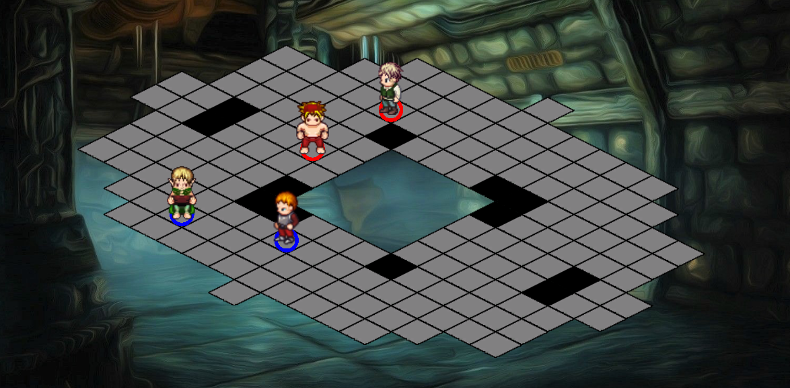

# DofusAISim

DofusAISim est un projet réalisé dans le le cadre de l'UE "M1if11 - Projet d'orientation en master" du M1 informatique de l’université Lyon 1. Il porte sur l'intelligence artificielle dans les tactical RPG et a été encadré par M. Samir Aknine.  

DofusAISim est une simulation inspirée des combats du jeu Dofus 1.29 : deux groupes s'affrontent sur une grille, au tour par tour, avec pour objectif de tuer tous les agents du groupe adverse. Chaque agent appartient à une classe, avec des capacités et des sorts unique, et peut être contrôlé par deux IA : simple ou spécialisée.
- L'IA simple est considérée comme naïve et a des comportements basiques.
- L'IA spécialisée est propre à la classe de l'agent afin d'exploiter au mieux ses habilités.

4 classes du jeu Dofus ont été implémentées :
- Le IOP : classe DPS spécialisée dans les buffs et les dégâts au corps à corps.
- Le CRA : classe DPS spécialisée dans les dégâts à distance, les sorts de recul et les debuffs.
- L'ENIRIPSA : classe healer spécialisée dans les soins et les buffs.
- Le SACRIEUR : classe tank spécialisée dans l'encaissement de dégâts et les buffs.

Pour plus d'informations, voir [rapport de projet](rapport.pdf).  

  

## Build

Vous trouverez un exécutable de la simulation : [ici](https://drive.google.com/drive/folders/1PNqc4q4abPeNKDe8mp3s1d04oVJAUzsF?usp=sharing).

## Pour commencer

La simulation a été réalisée sous [Unity](https://unity.com/).  
Veuillez suivre la démarche ci-dessous pour ouvrir le projet dans l'éditeur Unity.

### Pré-requis

- Plateforme de développement Unity : [lien](https://unity.com/fr/products/unity-platform)
- Unity version 2019.4.18.f1

### Installation

1. Téléchargez la plateforme de développement Unity
2. Installez la version 2019.4.18.f1
3. Ouvrez le projet avec Unity Hub

## Simulation

3 modes de simulation sont disponibles : Dungeon, Fight, Qlearn.

### Dungeon
Mode qui se rapproche des donjons du jeu Dofus.  
Vous choisissez vos agents, qui auront pour objectif de terminer toutes les salles avec une difficulté croissante.

  

Paramètres :  
- Group 1 : Les agents du groupe 1  
- Group play together : Si oui, les agents jouent tous en même temps durant le tour du groupe 1, sinon ils jouent chacun leur tour  
- Group leading : Si oui, applique un algorithme de Leader sur le groupe 1  
- Speed : Vitesse de la simulation  

### Fight
Combat entre deux groupes.

  

Paramètres :  
- Group 1 : Les agents du groupe 1  
- Group 2 : Les agents du groupe 2  
- Group play together : Si oui, les agents jouent tous en même temps durant le tour du groupe, sinon ils jouent chacun leur tour  
- Group leading : Si oui, applique un algorithme de Leader sur le groupe  
- Dungeon room : Grille de combat  
- Speed : Vitesse de la simulation  
- Number of games : Nombre de parties   

### Qlearn
Implémentation d'un algorithme d'aprentissage par renforcement, sur une grille de combat 1vs1.  

  

  

Paramètres :  
- Epsilon : taux d'exploration pour l'IA Qlearn (probabilité de jouer au hasard)  
- Coeff Epsilon : facteur d'apprentissage pour l'IA Qlearn  
- Training ratio : nombre de parties entre chaque apprentissage   
- P1 : IA de l'agent 1
- P2 : IA de l'agent 2  
- Trainable : Si oui, les IA Qlearn s'entraînent   
- Speed : Vitesse de la simulation  
- Number of games : Nombre de parties   

*Nb: La fonction player dans le choix de l'agent sert uniquement pour du Debug.*

## Auteurs

* **Titouan Knockaert** _alias_ [p2004365](https://forge.univ-lyon1.fr/p2004365)
* **Gaspard Goupy** _alias_ [p1708658](https://forge.univ-lyon1.fr/p1708658)
* **Gabriel FILIP** _alias_ [p1925741](https://forge.univ-lyon1.fr/p1925741)

## License

Voir [LICENSE.md](https://forge.univ-lyon1.fr/p1708658/dofusaisim/-/blob/master/LICENCE.md).
